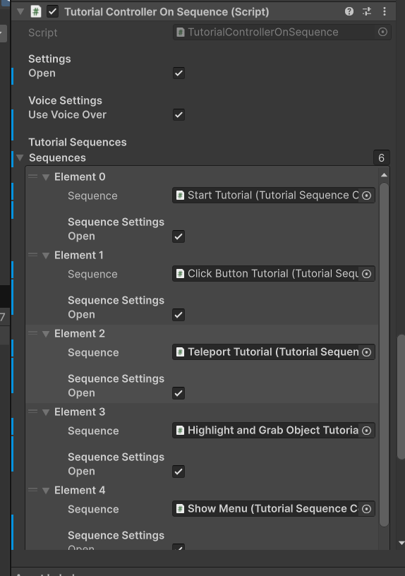

# VR Tutorial Template

Unity tutorial template for VR projects to allow developers to quickly add, remove, and customize interactive tutorials.

---

## About

- **Unity Version**: 6000.0.52f1  
- Provides a reusable **tutorial system** for VR projects with modular and sequence-based tutorials.

---

## Required Packages

- VR Interaction Framework (VRIF)  
- RT-Voice  
- Proto UI  
- Quick Outline  
- Audio Toolkit  
- Future UI Sound Library  

---

## Features

- Tutorial based on **modules** or **sequences**  
- Ready-to-use tutorial steps (teleport, grab, click)  
- Customizable tutorial step conditions using **UnityEvents**  
- Optional voice-over support with **RT-Voice**  
- Default step delay with optional per-step override  
- Open/close notification system  
- Progress indicator  
- Previous/Next step navigation  
- **UI customization** option  

---

## Getting Started

### 1. Import Required Packages
- Import all required packages listed above.  
- Import **TMP Essentials**  
  - Menu: `Window > TextMeshPro > Import TMP Essential Resources`

### 2. Import the Tutorial Template Package
- Import the tutorial template package into your Unity project.

### 3. Start with Example Scene
- Navigate to `TutorialTemplate > Example`  
- Choose a demo scene:  
  - **Tutorial with Sequence** – plays all tutorials in one flow  
  - **Tutorial with Modules** – tutorials grouped per module  
  - **Demo with UI Customization** – showcases UI customization options  

---

## How To

### Create a New Tutorial Sequence
1. Add `TutorialControllerOnSequence` script to a **Tutorial Canvas** object.  
2. Assign tutorials in the **Tutorial Sequences** list.  
3. Add a **Progress Indicator Text** to show progress.  
4. To skip a tutorial, uncheck **Open**.  
5. Add `TutorialNavigationController` to manage **Next/Previous** buttons.  

---

### Create a Tutorial Module
1. On the **Main Menu Panel**, add `TutorialModuleSelector`.  
2. Add your tutorial sequences to the **Modules** list.  
3. Assign the **Main Menu Panel** object.  
4. Enable **Force Voice Over** if desired.  
5. For each module button, call `TutorialModuleSelector.SelectModule`.  

  

---

### Configure Voice Over
1. Select **RT-Voice** object → add **Voice Pre-Generator**.  
2. Enter text → generate voice clips into a folder.  
3. Assign generated clips in **TutorialSequenceStep** scripts.  
4. Add **Audio Source** on the **Tutorial Canvas** if needed.  
5. Toggle **Use Voice Over** in `TutorialControllerOnSequence`.  
6. For modules, enable **Force Voice Over** in `TutorialModuleSelector`.  

  
  
  
  

---

### Trigger Next / Previous Step
- Add `TutorialNavigationController` alongside `TutorialControllerOnSequence`.  
- Assign controller and enable **Navigation**.  
- Buttons call:
  - `Next()` → go forward  
  - `Previous()` → go back (optionally reset step state)  
- To exit a module: call `TutorialModuleSelector.CloseCurrentModuleAndOpenMenu`.  

  
  
  
  

---

### Customize UI
1. Create a **Customize UI Controller** GameObject → add `UICustomizationController`.  
2. Create new **UICustomizationData** (`Create > UI > UICustomizationData`).  
3. Add `CustomizableUIText` (for TMP/Legacy text) or `CustomizableUIImage` (for images) to UI elements.  
4. Configure overrides (fonts, sizes, colors, sprites).  
5. Press **Apply Customization** on the controller.  

  
  
  
  
  

---
